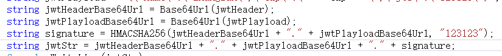

### 一.JWT简介

> JWT（JSON WEBTOKEN）
JSON网络令牌，JWT是一个轻便的安全跨平台传输格式，定义了一个紧凑的自包含的方式在不同实体之间安全传输信息（JSON格式）。
它是在Web环境下两个实体之间传输数据的一项标准，实际上传输的就是一个字符串。
广义上讲JWT是一个标准的名称；狭义上JWT指的就是用来传递的那个token字符串

- JWT是一种用于双方之间传递安全信息的简洁的、URL安全的表述性声明规范。
- JWT作为一个开放的标准（RFC 7519)定义了一种简洁的，自包含的方法用于通信双方之间以JSON对象的形式安全的传递信息。因为数字签名的存在，这些信息是可信的。
- JWT可以使用HMAC算法或者是RSA的公私秘钥对进行签名。

#### 优点
- 自包含：负载中包含了所有用户所需要的信息，避免了多次查询数据库；
- 可扩展性好：跨语言，支持过期，发布者校验

#### jwt的缺点：
- 安全性：由于jwt的payload是使用base64编码的，并没有加密，意味着该部分信息可以归类为明文信息，因此jwt中不能存储敏感数据，而session的信息是存在服务端的，相对来说更安全。
- 不适合存放大量信息：jwt太长。由于是无状态使用JWT，所有的数据都被放到JWT里，如果还要进行一些数据交换，那载荷会更大，经过编码之后导致jwt非常长，cookie的限制大小一般是4k，cookie很可能放不下，所以jwt一般放在local storage里面。并且用户在系统中的每一次http请求都会把jwt携带在Header里面，http请求的Header可能比Body还要大。而sessionId只是很短的一个字符串，因此使用jwt的http请求比使用session的开销大得多。
- 无法作废未过期的jwt：一旦签发一个jwt，在到期之前就会始终有效，无法中途废弃。例如你在payload中存储了一些信息，当信息需要更新时，则重新签发一个jwt，但是由于旧的jwt还没过期，拿着这个旧的jwt依旧可以登录的。

### 二.JWT构成
JWT通常由三部分组成: 头信息（header）, 消息体（payload）和签名（signature）。

#### 头信息（header）

头信息（header）主要为了描述该JWT的最基本信息，主要包含两个部分：声明类型和声明加密算法(通常直接使用HMAC，SHA256)。
````javascript
{
	"alg":"HS256",
	"typ":"JWT"
}
````
####载荷(PAYLOAD)

````javascript
{
    "iss": "nee32",//该JWT的签发者
    "iat": 1441593502,//签发时间戳
    "exp": 1441594722,//过期时间戳
	"nbf": 1441594722,//生效时间戳,在这时间之前不可用
    "aud": "www.example.com",//接收方
    "sub": "jrocket@example.com",//主题
    "jti": "12123",//jwt唯一身份标识，可以避免重放攻击
}
````
然后对载荷按照BASE64进行编码(该编码是可以对称解密)，这样就构成了JWT的第二部分。

####签名(SIGNATURE )
这个签名信息主要由三个部分组成：base64UrlEncode(header) + '.' + base64UrlEncode(payload);

我们将上面拼接完的字符串用HS256算法进行加密。在加密的时候，我们还需要提供一个密钥（secret）。加密后的内容也是一个字符串，最后这个字符串就是签名，把这个签名拼接在刚才的字符串后面就能得到完整的jwt。header部分和payload部分如果被篡改，由于篡改者不知道密钥是什么，也无法生成新的signature部分，服务端也就无法通过，在jwt中，消息体是透明的，使用签名可以保证消息不被篡改。

####JWT 注意事项

在使用 JWT 时需要注意以下事项：

1. JWT 默认不加密，如果要写入敏感信息必须加密，可以对PAYLOAD中的内容进行加密；
2. JWT 无法使服务器保存会话状态，当令牌生成后在有效期内无法取消也不能更改；
3. JWT 包含认证信息，如果泄露了，任何人都可以获得令牌所有的权限；因此 JWT 有效期不能太长，对于重要操作每次请求都必须进行身份验证。